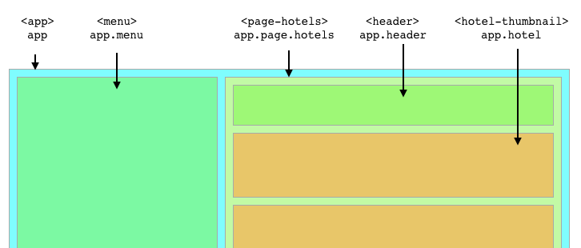

# IN Vision Day 2016

## Modern Web Development - Everything You Need to Start

In this intensive workshop we will set up a mobile-first web application with
all the good and state of the art parts. Let's have a look to the latest stable
AngularJS version, HTML5, LESS and Twitter Bootstrap. Everything is built up on
NodeJS with Gulp and Webpack.

At the end of the workshop you have a stable code base to build your own ideas.

Peter is Senior JavaScript Engineer & JavaScript Evangelist at the HOTEL DE GmbH in Nuremberg.
He gives talks at meetups and conferences and organizes the local JavaScript meetup FrankenJS.

## Setup

**If GIT is installed**

Switch to a folder where you want to clone the project into (e. g. `projects`) and run the command below.

```
git clone https://github.com/hotelde/in-vision-day-workshop-2016.git
```

Now switch to the new folder `ìn-vision-day-workshop-2016`.

```
cd in-vision-day-workshop-2016
```

Finally you have to install all dependencies via `NPM`.

```
npm install
```

**Download the zipped project**

TODO: https://some-where.com/foo.zip

This package contains all dependencies. No `npm install` required.

## Start the Development Server

To start coding we have to run our development server. In this technology stack we use webpack to build and serve our project.

```
npm run dev
```

Run the command above to run the webpack development server. After a few seconds it spawns our application at http://localhost:8080

Open the browser of your choice (but Google Chrome is recommended :)) and navigate to the URL.

If everything went well you should see our shiny new web application.

## Project Structure

```
api/                  # contains some JSON files to simulate our API
app/                  # All application components are in here
dist/                 # Contains the final application, tested and built
gulp/                 # Taks for development, testing and build
node_modules/         # All dependencies installed via NPM

.Gulpfile.js          # This file serves all gulp tasks
index.html            # Entry point of our web application
package.json          # Defines our project and dependencies
README.md             # Contains all information to set up the project
webpack.config.js     # Configuration file for webpack
```

## Application Structure

Our web application is built with components. This is a common way in modern web
development to structure code and apps. Hence each element can be defined in a
separate folder.

```
app/                  # Contains the initial application module
app/header/           # The application header
app/hotel/            # A component to represent a hotel
app/menu/             # The menu
app/pages/            # A component which handles our pages
app/pages/404/        # The 404 page if a requested page does not exist
app/pages/hotels/     # A list of hotels
app/pages/index/      # The start page
```

The application is built on AngularJS 1.5.3. Angular dependencies must be defined
in modules. This makes it easy to provide re-usable code. An angular module is
defined by a unique name. Since we have a clear folder structure, we can reuse
the path for name spacing / module naming.

Have a look at the code below how a angular module will be defined according to
the file path.

```js
// app/app.js

angular.module('app', [

  // Dependencies / other module names
  'app.pages'
]);
```

Let's have a look at a nested components

```js
// app/pages/pages.js

angular.module('app.pages', [

  // Dependencies / other module names
  'app.pages.index',
  'app.pages.hotels',
  'app.pages.404'
])
```

```js
//app/pages/404/404.js

angular.module('app.pages.404', [

  // This module has no dependencies
]);
```

## Components


